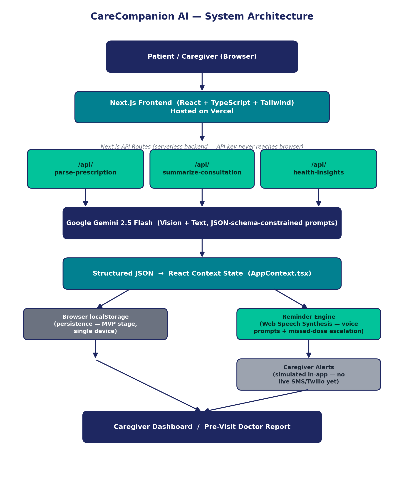

# CareCompanion AI

**AI-powered elder care and medication management — from prescription photo to voice reminder to caregiver alert.**

CareCompanion AI helps elderly patients and their remote family members stay on top of complex medicine schedules. A caregiver or patient photographs a doctor's prescription, the system extracts every medicine with its dosage, frequency, and timing using Gemini Vision AI, schedules personalized voice reminders, and keeps the caregiver informed through a live monitoring dashboard — all without the patient needing to type anything.

---

## Live Demo

🌐 [https://carecompanion-ai.vercel.app](https://carecompanion-ai.vercel.app)

---

## Key Features

- **AI Prescription Scanner** — Upload a photo of any handwritten or printed prescription. Gemini 2.5 Flash extracts medicine name, dosage, frequency, time of day, duration, and instructions as structured data.
- **Voice Reminder Engine** — At the scheduled time, the app speaks a friendly, personalized reminder aloud using the browser's Speech Synthesis API. Supports English, Hindi, Tamil, Telugu, Kannada, Malayalam, Bengali, Spanish, and French.
- **Missed Dose Escalation** — If a dose goes unacknowledged, the system automatically raises a caregiver alert on the dashboard.
- **Caregiver Dashboard** — Remote family members can monitor adherence percentage, taken/missed doses, and intake logs in real time.
- **Doctor Consultation Summarizer** — Records live doctor conversations using the browser's Speech Recognition API and sends the transcript to Gemini, which extracts diagnosis, instructions, medicines mentioned, risk level, and follow-up date as structured JSON.
- **AI Health Insights** — Analyzes adherence patterns and symptom logs to flag concerning trends and recommend a doctor visit when needed.
- **Pre-Visit Doctor Report** — Compiles the patient's adherence history and symptom logs into a one-page summary a doctor can review at the next appointment.
- **Multi-Patient Support** — Manage multiple patient profiles from a single caregiver account.
- **Light / Dark Mode** — Full theme system with persistent user preference.

---

## Tech Stack

| Layer | Technology |
|---|---|
| Frontend | Next.js 16 (App Router), React, TypeScript, Tailwind CSS |
| Backend | Next.js API Routes (serverless — API key never exposed to browser) |
| AI / Vision | Google Gemini 2.5 Flash (gemini-2.5-flash) |
| Voice Output | Browser Web Speech Synthesis API |
| Voice Input | Browser Web Speech Recognition API |
| Persistence | Browser localStorage (MVP stage) |
| Deployment | Vercel |

---

## Architecture



The system is built around three distinct serverless API routes, each making a separate JSON-schema-constrained call to Google Gemini 2.5 Flash:

- `/api/parse-prescription` — receives the prescription image, calls Gemini Vision, returns structured medicine list
- `/api/summarize-consultation` — receives the live transcript, calls Gemini, returns structured clinical summary
- `/api/health-insights` — receives adherence + symptom logs, calls Gemini, returns risk level and recommendation

All three routes run server-side so the Gemini API key is never exposed to the browser. Structured JSON output flows into React Context state, which drives the reminder engine, caregiver dashboard, and doctor report.

---

## Getting Started

### 1. Clone the repository
```bash
git clone https://github.com/manohhar2006-bit/carecompanion-AI.git
cd carecompanion-AI
```

### 2. Install dependencies
```bash
npm install
```

### 3. Configure environment variables
```bash
cp .env.local.example .env.local
```
Open `.env.local` and add your Gemini API key:
```
GEMINI_API_KEY=your_gemini_api_key_here
```
> Get a free Gemini API key at [https://aistudio.google.com](https://aistudio.google.com)

### 4. Run the development server
```bash
npm run dev
```
Open [http://localhost:3000](http://localhost:3000) in your browser.

---

## How the AI Pipeline Works

When a user uploads a prescription image, the frontend sends it to `/api/parse-prescription`, which passes it to Gemini 2.5 Flash as inline image data with a JSON-schema-constrained prompt. The model returns a structured array of medicines with name, dosage, frequency, time-of-day, exact reminder time, duration, and notes — no further parsing needed.

The consultation summarizer works similarly: the browser's SpeechRecognition API transcribes the live conversation, the transcript is sent to `/api/summarize-consultation`, and Gemini returns structured JSON with diagnosis, instructions, action items, risk level, and follow-up date.

The health insights engine at `/api/health-insights` receives missed-dose count, on-time count, and recent symptom logs, and returns a risk level, plain-language pattern summary, and actionable recommendation.

All three API routes enforce `response_mime_type: application/json` so output is consumed directly by the UI without any parsing logic.

---

## What's Real vs. Simulated

| Feature | Status | Notes |
|---|---|---|
| Prescription OCR | ✅ Real | Live Gemini 2.5 Flash vision call |
| Voice Reminders | ✅ Real | Browser Speech Synthesis API |
| Consultation Summarizer | ✅ Real | Live Gemini call on real transcript |
| Health Insights | ✅ Real | Live Gemini call on adherence + symptom data |
| Caregiver Alerts | ⚠️ Simulated | In-app only — no Twilio/SMS integration yet |
| Data Persistence | ⚠️ Simulated | Browser localStorage — single device only |
| Doctor Report Narrative | ⚠️ Partial | Uses real data but template-based text |
| Multi-device Sync | ❌ Not built | Planned with Firebase/Supabase |

---

## Sample Demo Data

The app includes seeded demo patient profiles (Mr. Ramesh, Mrs. Kamla) and a sample consultation transcript so you can test all features immediately without needing a real prescription or microphone.

---

## Future Scope

- Real-time caregiver SMS / WhatsApp alerts via Twilio
- Personalized voice reminders using family-recorded audio
- Multi-device sync via Firebase or Supabase
- Drug interaction and dosage safety validation against clinical data sources
- Emergency doctor contact integration
- Automatic medicine refill reminders

---

*Built solo as a 3rd year B.Tech CSE student at VIT Chennai for InnovateZ 2026.*
